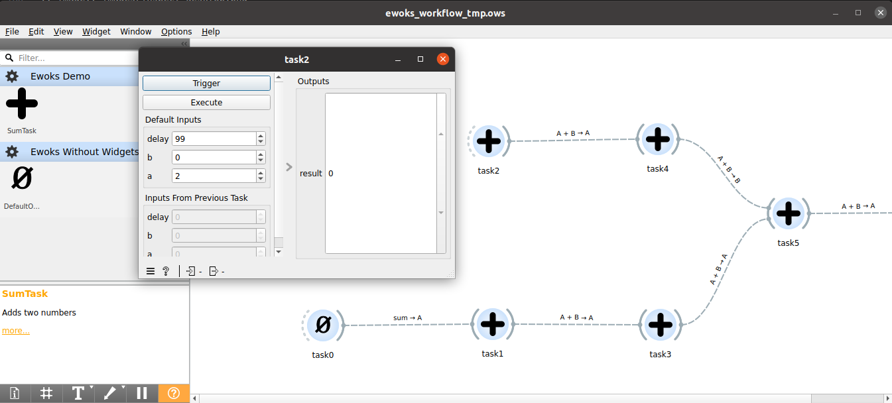
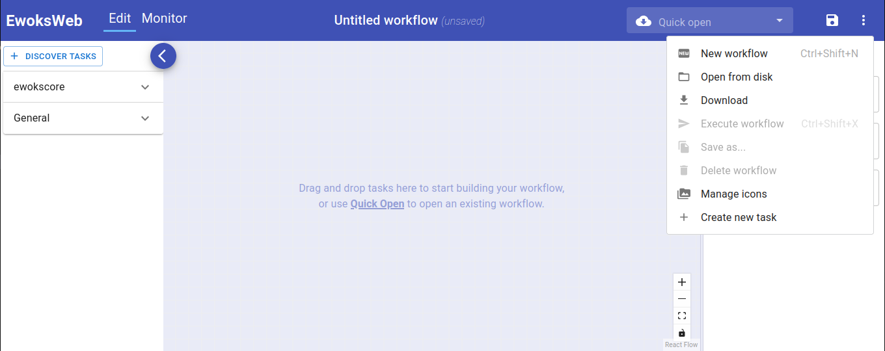
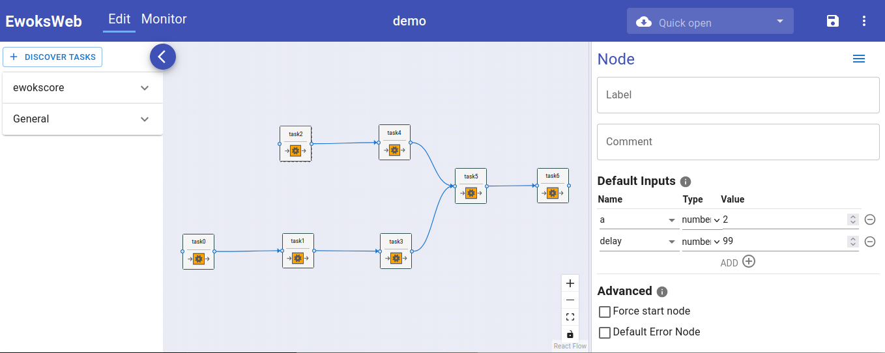

Inspect Workflow Inputs
=======================

Ewoks workflows use input parameters that can be configured for each node in the workflow.
This tutorial demonstrates how to inspect these input parameters using various methods.

Command-Line Inspection
-----------------------

When executing workflows, it's often helpful to inspect the available input parameters.
You can do this with `ewoks show` from the command line.

To list input parameters for the **demo** workflow:

.. code:: bash

    ewoks show demo --test

This will display all input parameters defined in the workflow, along with their default values
and the tasks they belong to:

.. code:: bash

    Workflow: demo
    Id: demo
    Description: demo
    ╒════════╤════════════════╤═══════════════════╤═══════╕
    │ Name   │ Value          │ Task identifier   │ Id    │
    ╞════════╪════════════════╪═══════════════════╪═══════╡
    │ list   │ [0, 1, 2]      │ SumList           │ task0 │
    ├────────┼────────────────┼───────────────────┼───────┤
    │ delay  │ 0              │ SumList           │ task0 │
    ├────────┼────────────────┼───────────────────┼───────┤
    │ delay  │ 0              │ SumTask           │ task1 │
    ├────────┼────────────────┼───────────────────┼───────┤
    │ b      │ <MISSING_DATA> │ SumTask           │ task1 │
    ├────────┼────────────────┼───────────────────┼───────┤
    │ a      │ 2              │ SumTask           │ task2 │
    ├────────┼────────────────┼───────────────────┼───────┤
    │ delay  │ 0              │ SumTask           │ task2 │
    ├────────┼────────────────┼───────────────────┼───────┤
    │ b      │ <MISSING_DATA> │ SumTask           │ task2 │
    ├────────┼────────────────┼───────────────────┼───────┤
    │ delay  │ 0              │ SumTask           │ task3 │
    ├────────┼────────────────┼───────────────────┼───────┤
    │ b      │ 3              │ SumTask           │ task3 │
    ├────────┼────────────────┼───────────────────┼───────┤
    │ delay  │ 0              │ SumTask           │ task4 │
    ├────────┼────────────────┼───────────────────┼───────┤
    │ b      │ 4              │ SumTask           │ task4 │
    ├────────┼────────────────┼───────────────────┼───────┤
    │ delay  │ 0              │ SumTask           │ task5 │
    ├────────┼────────────────┼───────────────────┼───────┤
    │ delay  │ 0              │ SumTask           │ task6 │
    ├────────┼────────────────┼───────────────────┼───────┤
    │ b      │ 6              │ SumTask           │ task6 │
    ╘════════╧════════════════╧═══════════════════╧═══════╛

The parameters with value `<MISSING_DATA>` do not have a value. When such parameters
are required, that are tagged with `(*)`. For example:

.. code:: bash

    Workflow: example.json
    Id: demo
    Description: demo
    ╒════════╤════════════════╤═══════════════════╤═══════╕
    │ Name   │ Value          │ Task identifier   │ Id    │
    ╞════════╪════════════════╪═══════════════════╪═══════╡
    │ a⁽*⁾   │ <MISSING_DATA> │ SumTask           │ task2 │
    ├────────┼────────────────┼───────────────────┼───────┤
    │ list   │ [0, 1, 2]      │ SumList           │ task0 │
    ├────────┼────────────────┼───────────────────┼───────┤
    │ delay  │ 0              │ SumList           │ task0 │
    ├────────┼────────────────┼───────────────────┼───────┤
    │ b      │ <MISSING_DATA> │ SumTask           │ task1 │
    ├────────┼────────────────┼───────────────────┼───────┤
    │ delay  │ 0              │ SumTask           │ task1 │
    ├────────┼────────────────┼───────────────────┼───────┤
    │ b      │ <MISSING_DATA> │ SumTask           │ task2 │
    ├────────┼────────────────┼───────────────────┼───────┤
    │ delay  │ 0              │ SumTask           │ task2 │
    ├────────┼────────────────┼───────────────────┼───────┤
    │ b      │ 3              │ SumTask           │ task3 │
    ├────────┼────────────────┼───────────────────┼───────┤
    │ delay  │ 0              │ SumTask           │ task3 │
    ├────────┼────────────────┼───────────────────┼───────┤
    │ b      │ 4              │ SumTask           │ task4 │
    ├────────┼────────────────┼───────────────────┼───────┤
    │ delay  │ 0              │ SumTask           │ task4 │
    ├────────┼────────────────┼───────────────────┼───────┤
    │ delay  │ 0              │ SumTask           │ task5 │
    ├────────┼────────────────┼───────────────────┼───────┤
    │ b      │ 6              │ SumTask           │ task6 │
    ├────────┼────────────────┼───────────────────┼───────┤
    │ delay  │ 0              │ SumTask           │ task6 │
    ╘════════╧════════════════╧═══════════════════╧═══════╛
    ⁽*⁾ Value is required for execution.

The parameter `a` of task `SumTask` is required and does not have a value for
the workflow node with id `task2`.

Inspecting Workflow Files
~~~~~~~~~~~~~~~~~~~~~~~~~

The `ewoks show` command can also inspect workflow definitions from a file.
For example, you can convert a test workflow to an `.ows` (Orange Workflow Schema) file:

.. code:: bash

    ewoks convert acyclic1 example.ows --test
    ewoks show example.ows

Sample output:

.. code:: bash

    Workflow: example.ows
    Id: acyclic1
    Description: acyclic1
    ╒════════╤════════════════╤═══════════════════╤══════╤═════════╕
    │ Name   │ Value          │ Task identifier   │   Id │ Label   │
    ╞════════╪════════════════╪═══════════════════╪══════╪═════════╡
    │ a      │ 1              │ SumTask           │    0 │ task1   │
    ├────────┼────────────────┼───────────────────┼──────┼─────────┤
    │ delay  │ <MISSING_DATA> │ SumTask           │    0 │ task1   │
    ├────────┼────────────────┼───────────────────┼──────┼─────────┤
    │ b      │ <MISSING_DATA> │ SumTask           │    0 │ task1   │
    ├────────┼────────────────┼───────────────────┼──────┼─────────┤
    │ a      │ 2              │ SumTask           │    1 │ task2   │
    ├────────┼────────────────┼───────────────────┼──────┼─────────┤
    │ delay  │ <MISSING_DATA> │ SumTask           │    1 │ task2   │
    ├────────┼────────────────┼───────────────────┼──────┼─────────┤
    │ b      │ <MISSING_DATA> │ SumTask           │    1 │ task2   │
    ├────────┼────────────────┼───────────────────┼──────┼─────────┤
    │ delay  │ <MISSING_DATA> │ SumTask           │    2 │ task3   │
    ├────────┼────────────────┼───────────────────┼──────┼─────────┤
    │ b      │ 3              │ SumTask           │    2 │ task3   │
    ├────────┼────────────────┼───────────────────┼──────┼─────────┤
    │ delay  │ <MISSING_DATA> │ SumTask           │    3 │ task4   │
    ├────────┼────────────────┼───────────────────┼──────┼─────────┤
    │ b      │ 4              │ SumTask           │    3 │ task4   │
    ├────────┼────────────────┼───────────────────┼──────┼─────────┤
    │ delay  │ <MISSING_DATA> │ SumTask           │    4 │ task5   │
    ├────────┼────────────────┼───────────────────┼──────┼─────────┤
    │ delay  │ <MISSING_DATA> │ SumTask           │    5 │ task6   │
    ├────────┼────────────────┼───────────────────┼──────┼─────────┤
    │ b      │ 6              │ SumTask           │    5 │ task6   │
    ╘════════╧════════════════╧═══════════════════╧══════╧═════════╛

Note that workflow nodes can be identified by `Task identifier`, `Id` or `Label`.
In case no workflow node has labels, the `Label` column is omitted.

Validating Execution Arguments
~~~~~~~~~~~~~~~~~~~~~~~~~~~~~~

To override workflow parameters for execution, use the `-p` option.

For example:

.. code:: bash

    ewoks execute demo --test -p SumTask:delay=99 --input-node-id taskid

Before executing, you can use `ewoks show` with the same arguments to preview the modified inputs:

.. code:: bash

    ewoks show demo --test -p SumTask:delay=99 --input-node-id taskid

Sample output:

.. code:: bash

    Workflow: demo
    Id: demo
    Description: demo
    ╒════════╤════════════════╤═══════════════════╤═══════╕
    │ Name   │ Value          │ Task identifier   │ Id    │
    ╞════════╪════════════════╪═══════════════════╪═══════╡
    │ list   │ [0, 1, 2]      │ SumList           │ task0 │
    ├────────┼────────────────┼───────────────────┼───────┤
    │ delay  │ 0              │ SumList           │ task0 │
    ├────────┼────────────────┼───────────────────┼───────┤
    │ delay  │ 99             │ SumTask           │ task1 │
    ├────────┼────────────────┼───────────────────┼───────┤
    │ b      │ <MISSING_DATA> │ SumTask           │ task1 │
    ├────────┼────────────────┼───────────────────┼───────┤
    │ a      │ 2              │ SumTask           │ task2 │
    ├────────┼────────────────┼───────────────────┼───────┤
    │ delay  │ 99             │ SumTask           │ task2 │
    ├────────┼────────────────┼───────────────────┼───────┤
    │ b      │ <MISSING_DATA> │ SumTask           │ task2 │
    ├────────┼────────────────┼───────────────────┼───────┤
    │ delay  │ 99             │ SumTask           │ task3 │
    ├────────┼────────────────┼───────────────────┼───────┤
    │ b      │ 3              │ SumTask           │ task3 │
    ├────────┼────────────────┼───────────────────┼───────┤
    │ delay  │ 99             │ SumTask           │ task4 │
    ├────────┼────────────────┼───────────────────┼───────┤
    │ b      │ 4              │ SumTask           │ task4 │
    ├────────┼────────────────┼───────────────────┼───────┤
    │ delay  │ 99             │ SumTask           │ task5 │
    ├────────┼────────────────┼───────────────────┼───────┤
    │ delay  │ 99             │ SumTask           │ task6 │
    ├────────┼────────────────┼───────────────────┼───────┤
    │ b      │ 6              │ SumTask           │ task6 │
    ╘════════╧════════════════╧═══════════════════╧═══════╛

When specifying an input parameter with `-p <name>:delay=99` the `<name>` comes
from the `Task identifier`, `Id` or `Label` column. By default it is the `Id`
but this can be changed with the `--input-node-id` command-line argument.

Desktop GUI
-----------

You can also inspect parameters visually using the desktop GUI:

.. code:: bash

    ewoks execute demo --test --engine=orange -p SumTask:delay=99 --input-node-id taskid

Double-click on each node to inspect input parameters:

Web GUI
-------

To inspect inputs via the web interface, convert the workflow to JSON and start the web server:

.. code:: bash

    ewoks convert demo example.json --test -p SumTask:delay=99 --input-node-id taskid

You should see output similar to:

.. code:: bash

    INFO:     Started server process [92729]
    INFO:     Uvicorn running on http://127.0.0.1:8000 (Press CTRL+C to quit)

Open the workflow file from disk:

Double-click on each node to inspect input parameters:

