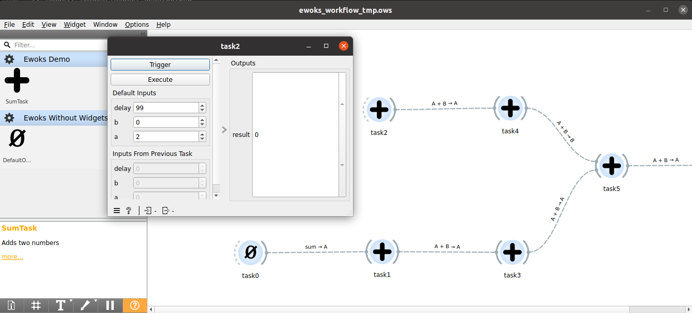

Inspect Workflow Inputs
=======================

Ewoks workflows use input parameters that can be configured for each node.
This tutorial demonstrates how to inspect and verify these input parameters using several methods.

We'll use the `demo` workflow from the Ewoks test suite as an example.
Convert it to JSON format with the following command:

.. code-block:: bash

    ewoks convert demo example.json --test

Command-Line Inspection
-----------------------

To view the input parameters defined in a workflow, use the `ewoks show` command:

.. code-block:: bash

    ewoks show example.json

This displays all input parameters, their values, and the workflow node they belong to:

.. code-block:: bash

    Workflow: example.json
    Id: demo
    Description: demo
    ╒════════╤════════════════╤═══════════════════╤═══════╕
    │ Name   │ Value          │ Task identifier   │ Id    │
    ╞════════╪════════════════╪═══════════════════╪═══════╡
    │ list   │ [0, 1, 2]      │ SumList           │ task0 │
    ├────────┼────────────────┼───────────────────┼───────┤
    │ delay  │ 0              │ SumList           │ task0 │
    ├────────┼────────────────┼───────────────────┼───────┤
    │ delay  │ 0              │ SumTask           │ task1 │
    ├────────┼────────────────┼───────────────────┼───────┤
    │ b      │ <MISSING_DATA> │ SumTask           │ task1 │
    ├────────┼────────────────┼───────────────────┼───────┤
    │ a      │ 2              │ SumTask           │ task2 │
    ├────────┼────────────────┼───────────────────┼───────┤
    │ delay  │ 0              │ SumTask           │ task2 │
    ├────────┼────────────────┼───────────────────┼───────┤
    │ b      │ <MISSING_DATA> │ SumTask           │ task2 │
    ├────────┼────────────────┼───────────────────┼───────┤
    │ delay  │ 0              │ SumTask           │ task3 │
    ├────────┼────────────────┼───────────────────┼───────┤
    │ b      │ 3              │ SumTask           │ task3 │
    ├────────┼────────────────┼───────────────────┼───────┤
    │ delay  │ 0              │ SumTask           │ task4 │
    ├────────┼────────────────┼───────────────────┼───────┤
    │ b      │ 4              │ SumTask           │ task4 │
    ├────────┼────────────────┼───────────────────┼───────┤
    │ delay  │ 0              │ SumTask           │ task5 │
    ├────────┼────────────────┼───────────────────┼───────┤
    │ delay  │ 0              │ SumTask           │ task6 │
    ├────────┼────────────────┼───────────────────┼───────┤
    │ b      │ 6              │ SumTask           │ task6 │
    ╘════════╧════════════════╧═══════════════════╧═══════╛

Parameters with `<MISSING_DATA>` do not have a value. If a missing parameter is **required**, it is marked with a `(*)`. For example:

.. code-block:: bash

    Workflow: example.json
    Id: demo
    Description: demo
    ╒════════╤════════════════╤═══════════════════╤═══════╕
    │ Name   │ Value          │ Task identifier   │ Id    │
    ╞════════╪════════════════╪═══════════════════╪═══════╡
    │ a⁽*⁾   │ <MISSING_DATA> │ SumTask           │ task2 │
    ├────────┼────────────────┼───────────────────┼───────┤
    │ list   │ [0, 1, 2]      │ SumList           │ task0 │
    ├────────┼────────────────┼───────────────────┼───────┤
    │ delay  │ 0              │ SumList           │ task0 │
    ├────────┼────────────────┼───────────────────┼───────┤
    │ b      │ <MISSING_DATA> │ SumTask           │ task1 │
    ├────────┼────────────────┼───────────────────┼───────┤
    │ delay  │ 0              │ SumTask           │ task1 │
    ├────────┼────────────────┼───────────────────┼───────┤
    │ b      │ <MISSING_DATA> │ SumTask           │ task2 │
    ├────────┼────────────────┼───────────────────┼───────┤
    │ delay  │ 0              │ SumTask           │ task2 │
    ├────────┼────────────────┼───────────────────┼───────┤
    │ b      │ 3              │ SumTask           │ task3 │
    ├────────┼────────────────┼───────────────────┼───────┤
    │ delay  │ 0              │ SumTask           │ task3 │
    ├────────┼────────────────┼───────────────────┼───────┤
    │ b      │ 4              │ SumTask           │ task4 │
    ├────────┼────────────────┼───────────────────┼───────┤
    │ delay  │ 0              │ SumTask           │ task4 │
    ├────────┼────────────────┼───────────────────┼───────┤
    │ delay  │ 0              │ SumTask           │ task5 │
    ├────────┼────────────────┼───────────────────┼───────┤
    │ b      │ 6              │ SumTask           │ task6 │
    ├────────┼────────────────┼───────────────────┼───────┤
    │ delay  │ 0              │ SumTask           │ task6 │
    ╘════════╧════════════════╧═══════════════════╧═══════╛
    ⁽*⁾ Value is required for execution.

In this case, the `a` parameter for task `SumTask` at node `task2` is required and must be provided before execution.

Workflow nodes can be identified by:

- **Task identifier** – the identifier of the code to be executed.
- **Id** – the unique identifier of the node within the workflow.
- **Label** (if present) – a human-readable tag, which may not be unique.

If no labels are defined, the `Label` column is omitted from the output.

Validating Execution Arguments
~~~~~~~~~~~~~~~~~~~~~~~~~~~~~~

Workflow parameters can be overridden at execution time using one of the following options:

* ``-pt TASK_ID:NAME=VALUE`` — apply to all nodes with the specified task identifier
* ``-pn NODE_ID:NAME=VALUE`` — apply to the node with the specified node id
* ``-pl LABEL:NAME=VALUE`` — apply to all nodes with the specified label
* ``-ps NAME=VALUE`` — apply to all start nodes
* ``-pa NAME=VALUE`` — apply to all nodes

For example, to target a specific task identifier:

.. code-block:: bash

    ewoks execute example.json -pt SumTask:delay=99

Before executing the workflow, you can verify that your arguments are applied as intended using `ewoks show` with the same arguments:

.. code-block:: bash

    ewoks show example.json -pt SumTask:delay=99

The output will reflect the overridden `delay` values:

.. code-block:: bash

    Workflow: example.json
    Id: demo
    Description: demo
    ╒════════╤════════════════╤═══════════════════╤═══════╕
    │ Name   │ Value          │ Task identifier   │ Id    │
    ╞════════╪════════════════╪═══════════════════╪═══════╡
    │ list   │ [0, 1, 2]      │ SumList           │ task0 │
    ├────────┼────────────────┼───────────────────┼───────┤
    │ delay  │ 0              │ SumList           │ task0 │
    ├────────┼────────────────┼───────────────────┼───────┤
    │ delay  │ 99             │ SumTask           │ task1 │
    ├────────┼────────────────┼───────────────────┼───────┤
    │ b      │ <MISSING_DATA> │ SumTask           │ task1 │
    ├────────┼────────────────┼───────────────────┼───────┤
    │ a      │ 2              │ SumTask           │ task2 │
    ├────────┼────────────────┼───────────────────┼───────┤
    │ delay  │ 99             │ SumTask           │ task2 │
    ├────────┼────────────────┼───────────────────┼───────┤
    │ b      │ <MISSING_DATA> │ SumTask           │ task2 │
    ├────────┼────────────────┼───────────────────┼───────┤
    │ delay  │ 99             │ SumTask           │ task3 │
    ├────────┼────────────────┼───────────────────┼───────┤
    │ b      │ 3              │ SumTask           │ task3 │
    ├────────┼────────────────┼───────────────────┼───────┤
    │ delay  │ 99             │ SumTask           │ task4 │
    ├────────┼────────────────┼───────────────────┼───────┤
    │ b      │ 4              │ SumTask           │ task4 │
    ├────────┼────────────────┼───────────────────┼───────┤
    │ delay  │ 99             │ SumTask           │ task5 │
    ├────────┼────────────────┼───────────────────┼───────┤
    │ delay  │ 99             │ SumTask           │ task6 │
    ├────────┼────────────────┼───────────────────┼───────┤
    │ b      │ 6              │ SumTask           │ task6 │
    ╘════════╧════════════════╧═══════════════════╧═══════╛

The `-pt` flag uses the task identifier as the target prefix in the format `<taskid>:<parameter>=<value>`, so `-pt SumTask:delay=99` applies `delay=99` to all nodes whose task identifier is `SumTask`.

Graphical Interfaces
--------------------

You can also inspect input parameters using graphical tools.

Desktop GUI
~~~~~~~~~~~

To use the :ref:`desktop GUI <ewoks-canvas>` based on Orange:

.. code-block:: bash

    ewoks execute example.json --engine=orange -pt SumTask:delay=99

Then double-click on each node to inspect or edit parameters:

Web GUI
~~~~~~~

To inspect parameters via the :ref:`web interface <ewoksweb>`:

1. Convert the workflow while applying overrides:

    .. code-block:: bash

        ewoks convert example.json example_with_params.json --test -pt SumTask:delay=99

2. Start the web server:

    .. code-block:: bash

        ewoksweb

    You should see:

    .. code-block:: bash

        INFO:     Uvicorn running on http://127.0.0.1:8000 (Press CTRL+C to quit)

3. Open the workflow file in your browser:

    .. image:: images/inspect_web_open.png
        :alt: Open the workflow file from disk in the web UI.

4. Click on a node to view or edit its parameters:

    .. image:: images/inspect_web_node.png
        :alt: Click on each node to inspect input parameters.
